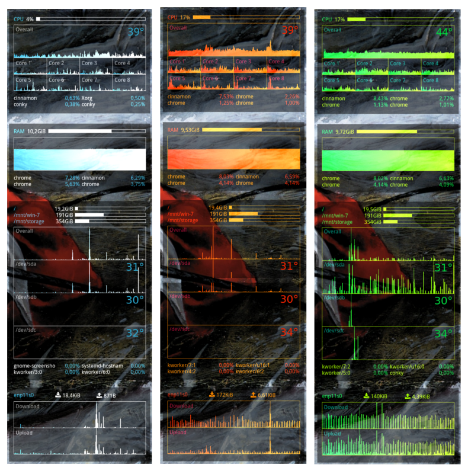

# Features

* Clean design. No excesses, only the needed information.
* Easy installation and usage. Detailed documentation provided.
* Modular. Individual panels may be turned on and off, be repositioned on screen.
* Customizable. Main colors can be changed for all panels at the same time.
* Wallpaper-agnostic. May be placed on any wallpaper and still be readable.

# Requirements

## Fonts

### Droid Sans

The Droid font is used for textual information: <https://www.google.com/fonts/specimen/Droid+Sans>

### Font Awesome

The FontAwesome font is used to draw the icons. Get it via apt: `sudo apt install fonts-font-awesome`

## hddtemp

`hddtemp` is needed for hard disk temperature monitoring, if you use the HDD panel.

### Installation

In Ubuntu you can install the `hddtemp` tool via apt: `sudo apt install hddtemp`

### Configuration

If needed, reconfigure `hddtemp` to allow usage as a non-root user: `sudo dpkg-reconfigure hddtemp`

**Warning**. The temperature data is sensitive and it may not be safe to share it with non-root users if the PC is used as a public server, for example.

## Conky Manager

It is recommended to use the [Conky Manager]() app to turn on and off individual panels and to auto-start them on session start.

### Installation

The package can be found in this PPA: <https://launchpad.net/~teejee2008/+archive/ubuntu/ppa>

1. Add the PPA to your system: `sudo apt-add-repository ppa:teejee2008/ppa && sudo apt-get update`
2. Install the app: `sudo apt-get install conky-manager`

# Installation

Copy the `ru.turbanov.conky` folder to your home directory at `~/.conky`. Launch the Conky Manager app and refresh the list. Activate the needed panels.

# Configuration

Feel hacky about configuring the panel conky files. The main common configuration is in the `common.lua` file. You can set the main colors there.
Configure the screen positions of individual panels by changing their corresponging `-panel.lua` files. Set the `gap_x` and `gap_y` and `alignment` variables accordingly.

## HDD

Open the `hdd-panel.lua` file to edit the configuration of the HDD panel.

### Filesystems

Go to the `-- Filesystems --` paragraph. Edit the list of mount points and add/remove the filesystem items according to your system.

### Usage

Go the `-- Disk Usage --` paragraph. Edit the list of disks to be monitored and add/remove the items accordingly.

In order for disk temperature to be working, [hddtemp](#hddtemp) has to be installed and configured appropriately.

