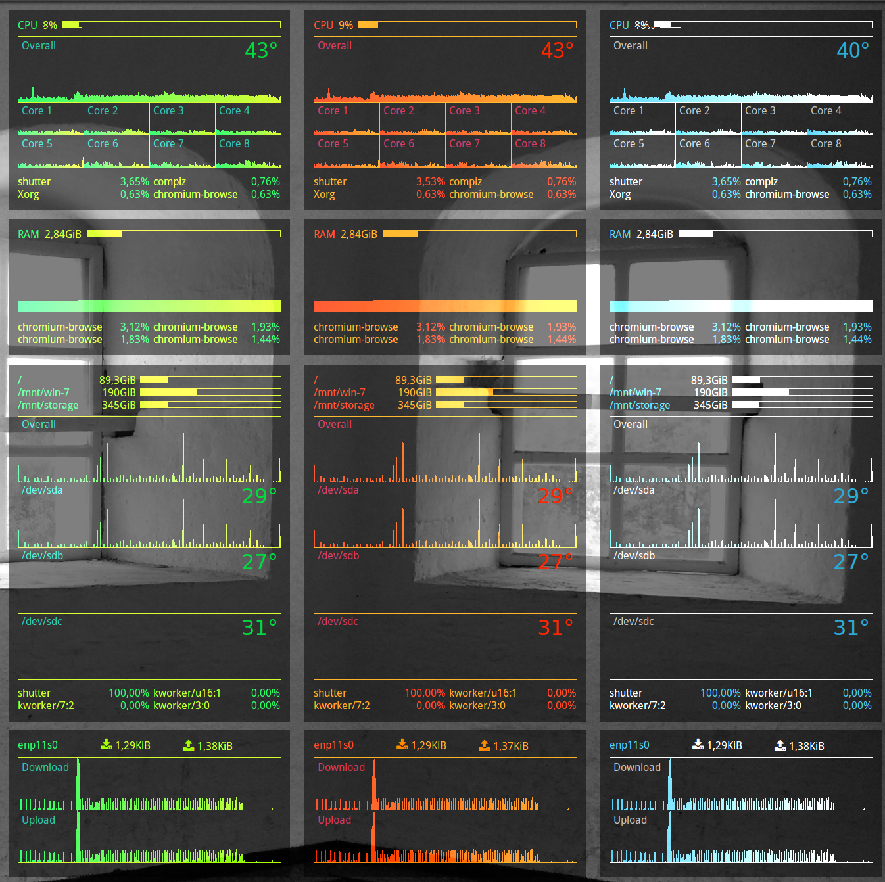

# Features



* Clean design. No excesses, only the needed information.
* Easy installation and usage. Detailed documentation provided.
* Modular. Individual panels may be turned on and off, be repositioned on screen.
* Customizable. The main colors can be changed for all panels at the same time. Three themes built in.
* Wallpaper-agnostic. May be placed on any wallpaper and still be readable.
* Lua-only. The most recent standard for conkies.


# License

[BSD](LICENSE)


# Requirements

## Conky

The [Conky](https://github.com/brndnmtthws/conky) itself. The panels were tested to work on version 1.10.2.

You can install Conky from the PPA at here: <https://launchpad.net/~vincent-c/+archive/ubuntu/conky>

```bash
sudo add-apt-repository ppa:vincent-c/conky
sudo apt-get update
sudo apt-get install conky-all
```


## Fonts

### Droid Sans

The Droid font is used for textual information. You can direct yourself through official Google pages to download a copy: <https://www.google.com/fonts/specimen/Droid+Sans>


### Font Awesome

The [FontAwesome](http://fontawesome.io) font is used to draw the icons. Can be installed via `apt-get` tool: `sudo apt-get install fonts-font-awesome`


## hddtemp

The `hddtemp` tool (service) is needed for hard disk temperature monitoring, when you use the HDD panel.


### Installation

On Ubuntu you can install the `hddtemp` tool via `apt-get` tool: `sudo apt-get install hddtemp`


### Configuration

If needed, reconfigure `hddtemp` to allow usage as a non-root user: `sudo dpkg-reconfigure hddtemp`

**Warning**. The temperature data is sensitive and it may not be safe to share it with non-root users if the PC is used as a public server, for example.


## Conky Manager

It is recommended to use the [Conky Manager](http://www.teejeetech.in/p/conky-manager.html) application to turn enable and disable individual panels and to auto-start them on session start.


### Installation

The package can be found in this PPA: <https://launchpad.net/~teejee2008/+archive/ubuntu/ppa>

1. Add the PPA to your system: `sudo apt-add-repository ppa:teejee2008/ppa && sudo apt-get update`
2. Install the application: `sudo apt-get install conky-manager`


# Installation

Clone this repository to your Conky folder:

```bash
cd ~/.conky
git clone https://github.com/vladipus/conky-panels.git
```


# Configuration

Gotta feel hacky about configuring the provided conkies. That is, you have to edit the source files, not some configuration data. Don't worry that's not hard at all and this documentation is non-programmer-safe.

The main common configuration is in the `common.lua` file. You can set the main colors there. Just open the file in your favorite editor and change the numerical color values, presented in an RRGGBB format.


## Theming

Three themes are actually built-in: `Icy`, `Hot` and `Vitamin`. To use one of those, open the `common.lua` file and uncomment the theme's color preset. That is, remove the `--[[` characters at its start and `]]` after.


## Placement

Configure the screen positions of individual panels by changing their corresponding `<type>-panel.lua` files. Set the `gap_x` and `gap_y` and `alignment` variables accordingly.


## Sizing

The conkies are fixed-width and you should not really change the predefined horizontal size. If you do, you would have to reposition some labels inside the conkies, so do that at your own risk.

In case you see some excessive empty space at the bottom of the panel (due to how Conky lay outs the elements), search for the `-- Bottom Padding --` comment at the bottom of the corresponding `<type>-panel.lua` file. Decrease the `voffset` numerical value consequently to adjust the padding size.


## CPU

### Cores

By default, the CPU panel monitors 8 cores. Chances are your system has more or less. 

To add or remove specific core graphs edit the `./cpu-panel.lua` file. Find an
`-- Individual Cores --` comment and look for core pack additions. Remove some by commenting them out, or add more by copy-pasting and setting the indexes accordingly. You can get the number of available cores on your system by running the `nproc` command.


## HDD

Open the `hdd-panel.lua` file to edit the configuration of the HDD panel.


### Filesystems

Go to the `-- Filesystems --` paragraph. Edit the list of mount points and add/remove the filesystem items according to your system.


### Usage

Go the `-- Disk Usage --` paragraph. Edit the list of disks to be monitored and add/remove the items accordingly.

In order for disk temperature to be working, [hddtemp](#hddtemp) has to be installed and configured appropriately.


## NET

### Devices

You can easily add your network devices by adding them into the array at the beginning of the file (separating them with a comma `,` symbol).

To find out what devices are available on your system issue a `sudo ifconfig` command in the terminal. The names should be listed on the left side of the output.
